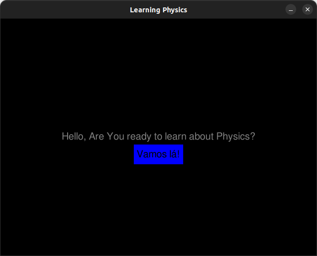
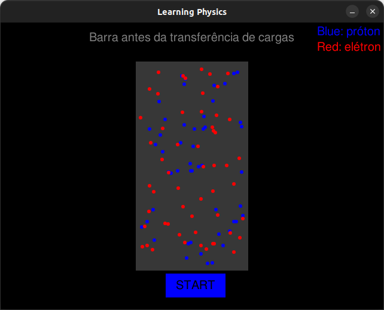
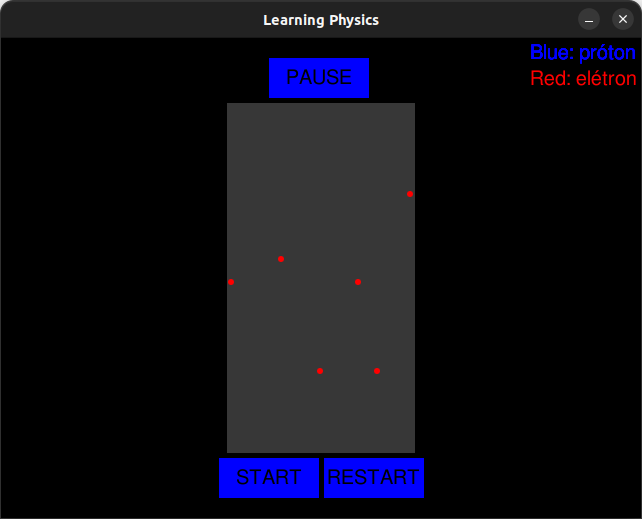
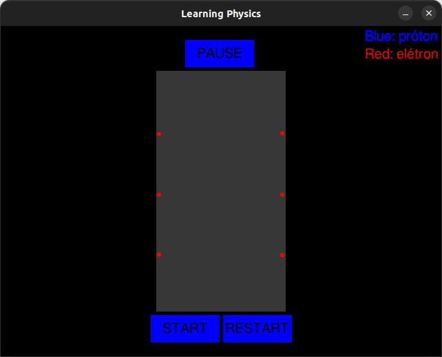
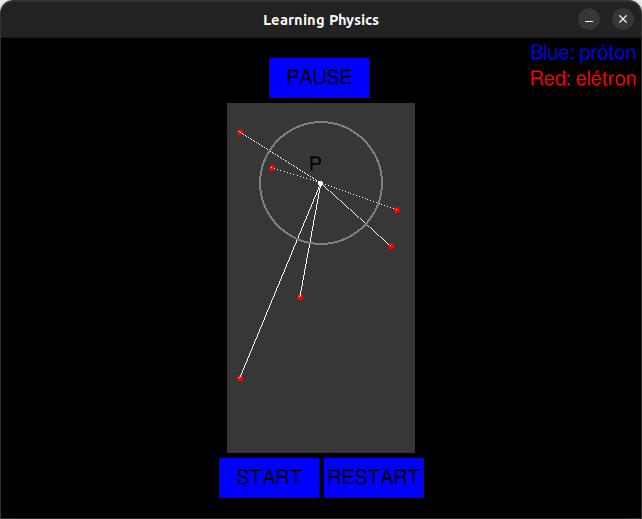
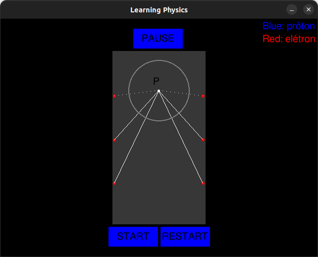

# Software Educacional Sobre Física

## Ideia

A ideia deste projeto surgiu quando eu estava cursando uma disciplina de Física na minha faculdade, de forma que eu tinha que apresentar um projeto no fim do semestre, foi aí que eu uni os meus conhecimentos sobre Física e programação para realiza-lo.

Inicialmente, o assunto abordado no projeto foi sobre a movimentação interna das partículas em um corpo condutor após uma troca de carga com um outro corpo ou afins.

## Funcionamento

### Primeira Interface:
<html>

  

    Nesta interface foi inserida apenas um botão para uma melhor interação com o usuário, como na imagem abaixo.
  

  

</html>

### Segunda Interface
<html>

  

    Esta interface apenas demosntra uma simulação idealizada de como as partículas se posicionam dentro de um corpo.
  

  

</html>

### Terceira Interface
<html>

  

    Incialmente, o software inicializa o corpo com as partículas posicionadas de maneira aleatória, como na imagem abaixo.
  

   
  
   
  

    Posteriormente, o mesmo realiza uma interação que faz com que tais partículas se movimentem de forma que as suas posições finais sejam tais que elas ficam uniformemente distribuídas na superfície do corpo.
  

   
  

### Quarta Interface
<html>

  

    Finalmente chegamos na interação final, onde há apenas o acréscimo do que na Física se denomina como gaussiana, o qual é uma superfície traçada em qualquer região do corpo para fins de análises elétricas da região. Além disso, foram inseridas retas direcionais para que o usuário pudessa observar a influência de cada partícula com um ponto dado durante a interação.
  

   
  
   
  

</html>

